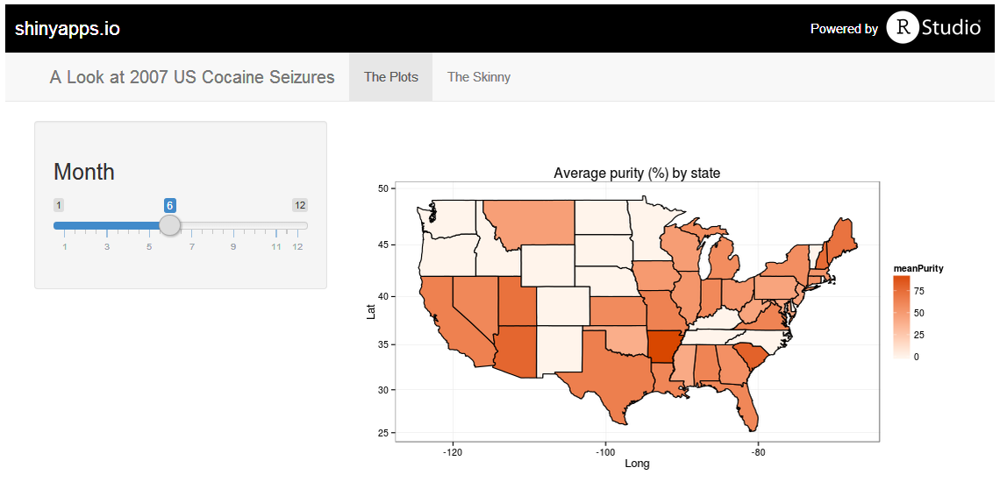

# Examining US Cocaine Seizures in 2007
## Coursera's "Developing Data Products"
### Jose M. Albornoz

--- .class #id 

## Introduction

* A Shiny app that summarizes and displays data about US cocaine seizures during 2007

* The app presents 3 maps, each showing the following information by US state for a particular month:  
    
    * Average cocaine purity (%) 
    * Total seizure weight (grams)
    * Total seizure value (US$)
    
* All the user has to do is to select a month (in numeric format) using a slider; the maps are automatically updated. 

* The app can be found [here] (https://jmalbornoz.shinyapps.io/ProjectC/) 

* Source code can be found [here] (https://github.com/jmalbornoz/developing-data-products-project)

--- .class #id 

## What it looks like

<div style='text-align: center;'>
    
</div>

* Scroll up and down to see the 3 maps

* The data is included in the **ggvis** package; it comes from DEA's **STRIDE**, [System to Retrieve Information from Drug Evidence] (http://www.dea.gov/resource-center/stride-data.shtml)

--- .class #id 

## Dataset Treatment Example 1

* The dataset consists of 3380 observations, each comprising

    * Abbreviation for the state in which the seizure took place 
    * Potency of the drug expressed as a percentage
    * Weight of the seizure in grams 
    * Month in which the seizure occurred 
    * Estimated value of the seizure in USD.

* State abbreviations are converted to to full state names in lowercase


```r
    library(ggvis); data(cocaine)
    convertName <- function(abb) {
       tolower(state.name[grep(abb, state.abb)])
    }     
    cocaine$state <- as.character(sapply(cocaine$state, convertName)) 
```

--- .class #id 

## Dataset Treatment Example 2

* The data is filtered by month; then an appropriate summary is obtained (mean/total)


```r
      theMonth <- 6  # supplied by the user through the slider!
      prepData1 <- function(theMonth) {
         theDataTable <- data.table(subset(cocaine, month == theMonth))
         avgPurityByState <- theDataTable[,list(meanPurity=mean(potency)),by=state]
      }
      avgPurityByState <- prepData1(theMonth)
      print(head(avgPurityByState))   # let's take a look at the results....
```

```
##           state meanPurity
## 1:      indiana   60.26667
## 2:      florida   61.42308
## 3: pennsylvania   45.30000
## 4:   new jersey   44.50000
## 5:     illinois   53.20000
## 6:   california   64.75000
```

* 

